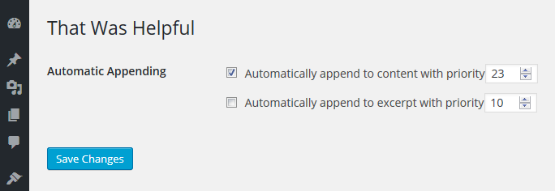
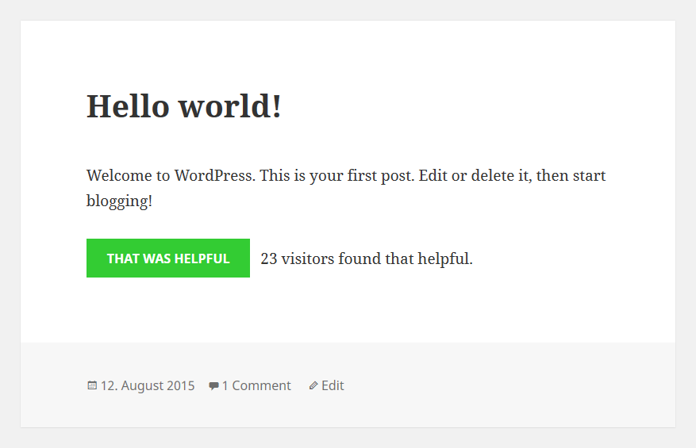

# That Was Helpful

[](https://packagist.org/packages/tfrommen/that-was-helpful)
[](http://opensource.box.com/badges)
[](http://travis-ci.org/tfrommen/that-was-helpful)
[](https://packagist.org/packages/tfrommen/that-was-helpful)

Have you ever wanted to know about the quality of your posts? At least a little bit?

This is exactly when _That Was Helpful_ kicks in.

This simple plugin lets you track how many logged-in users found individual posts helpful.

## Installation

1. [Download ZIP](https://downloads.wordpress.org/plugin/that-was-helpful.zip).
1. Upload contents to the `/wp-content/plugins` directory on your web server.
1. Activate the plugin through the _Plugins_ menu in WordPress.
1. Use the _That Was Helpful_ form either by defining _Automatic Appending_ to content/excerpt on the according _That Was Helpful_ settings page, or by using `do_action( 'that_was_helpful', $optional_post_id )` somewhere in your template files.

## Usage

What this plugin is all about is providing a means to mark individual posts helpful. Each unique user can vote only once for each post. Of course, cast votes can be retracted.

### Settings

On the plugin's _That Was Helpful_ settings page, you can have the form be automatically appended to the content and/or excerpt of your posts.

### Actions

In case you want to show the form depending on some (complicated) condition (and not always), simply wrap `do_action( 'that_was_helpful', $optional_post_id )` in the condition, and put it in your desired template file(s). If you provide an existing post ID as parameter, the according post's votes are displayed. Otherwise the current post is used.

### Filters

In order to customize certain aspects of the plugin, it provides you with several filters. For each of these, a short description as well as a code example on how to alter the default behavior is given below. Just put the according code snippet in your theme's `functions.php` file or your _customization_ plugin, or to some other appropriate place.

#### `that_was_helpful_capability`

Managing the plugin's settings is restricted to a certain capability, which is by default `manage_options`.

```php
/**
 * Filter the capability required to manage the settings.
 *
 * @param string $capability Capability required to manage the settings.
 */
add_filter( 'that_was_helpful_capability', function() {
	
	return 'edit_users';
} );
```

## Contribution

If you have a feature request, or if you have developed the feature already, please feel free to use the Issues and/or Pull Requests section.

Of course, you can also provide me with translations if you would like to use the plugin in another not yet included language.

## Screenshots

  
**Settings page** - Here you can manage your settings (i.e., automatically append to content and/or excerpt).

  
**Frontend** - Frontend view for a logged-in user who marked the according post helpful.

## Changelog

[Changelog](CHANGELOG.md)
